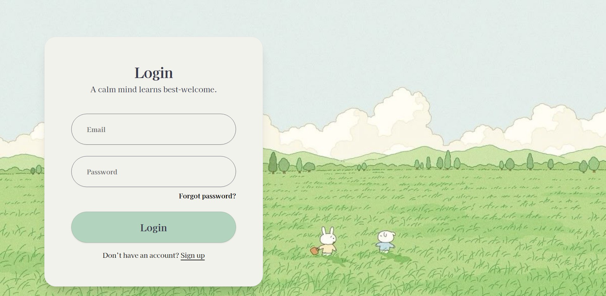
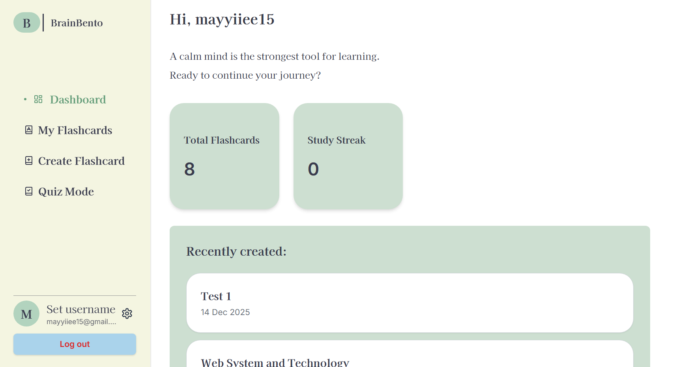
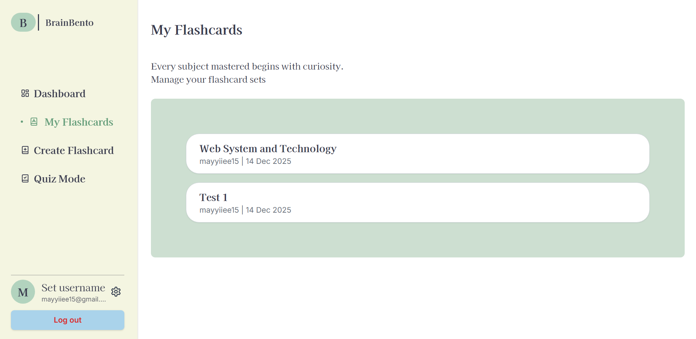
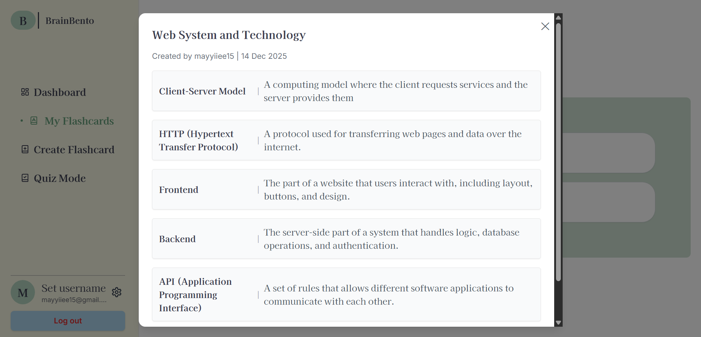
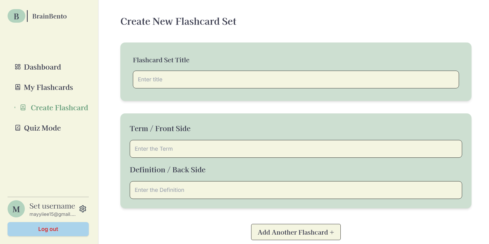
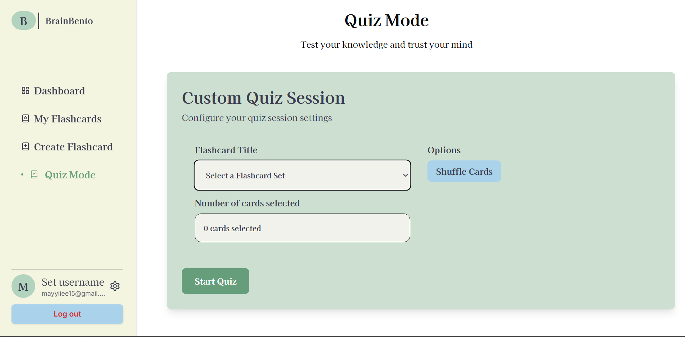
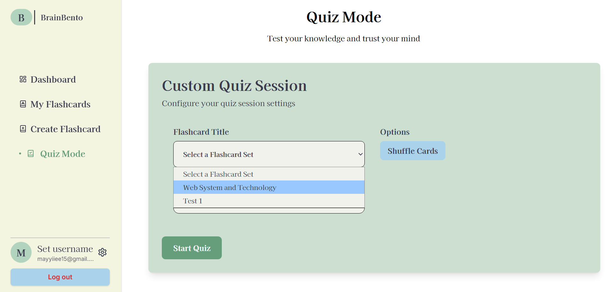
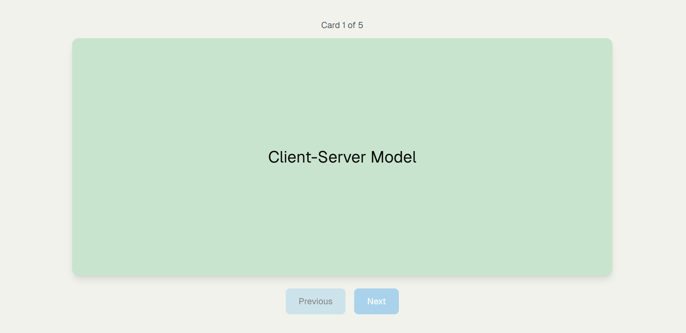

# 🧠BrainBento

---

**BrainBento** is a web-based **exam reviewer and flashcard platform** designed to help students study smarter and more effectively. It allows users to review topics, test their knowledge, and retain information through interactive flashcards and reviewer-style content.

---

## ✨ **Features**

* 📖 **Exam Reviewer** – Structured review content per subject or topic
* 🗂️ **Flashcards** – Simple and effective flashcards for memorization
* 🔐 **User Authentication** – Login system for users

---

## 🛠️ Technologies Used

* **Frontend Framework:** Next.js (React), Typescript
* **Backend:**  Supabase (PostgresSQL, Auth)
* **Styling:** Tailwind CSS with shadcn/ui  components
* **Version Control:** Git & GitHub
* **Authentication:**  Supabase  Auth
* **Deployment:** Vercel

## Pages

---

**Login Page**

- This page is for the login and Sign up function  for the website.

**Dashboard Page**

- This page shows an overview of the website

**My Flashcards Page**

- This  page shows the list of Flashcard sets you have.

**Flashcards displayed in a modal  per set.**

**Create Flashcard  Page**

- This page is for creating a flashcard set.

**Quiz Mode Page**

- This page lets you configure your quiz session settings.

**Quiz Preview Page**

- This page allows you to preview a flashcard and flip it to view both sides.
